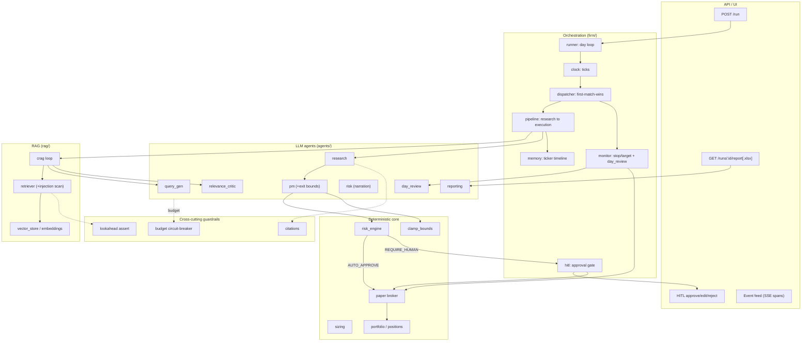
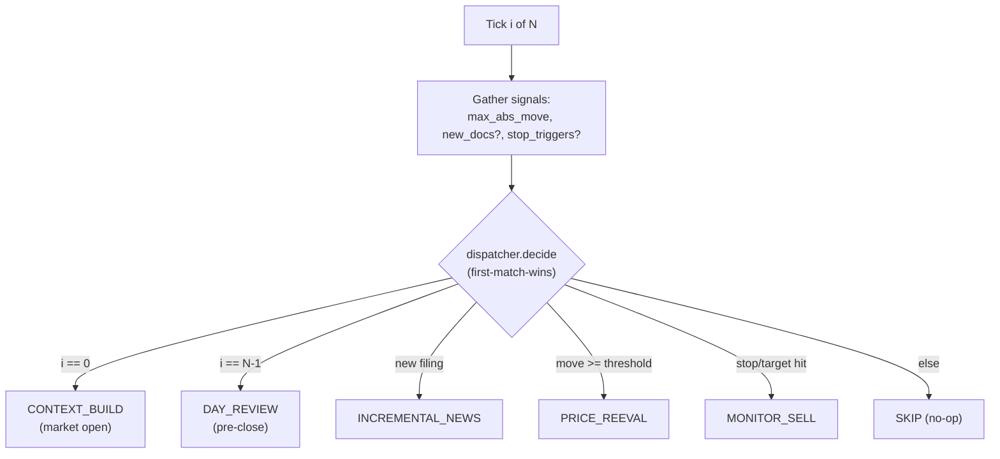
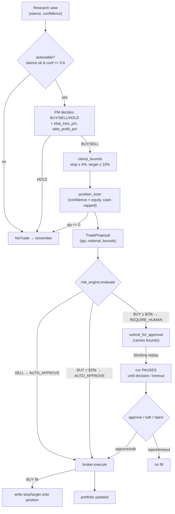
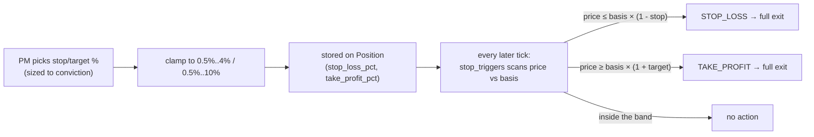
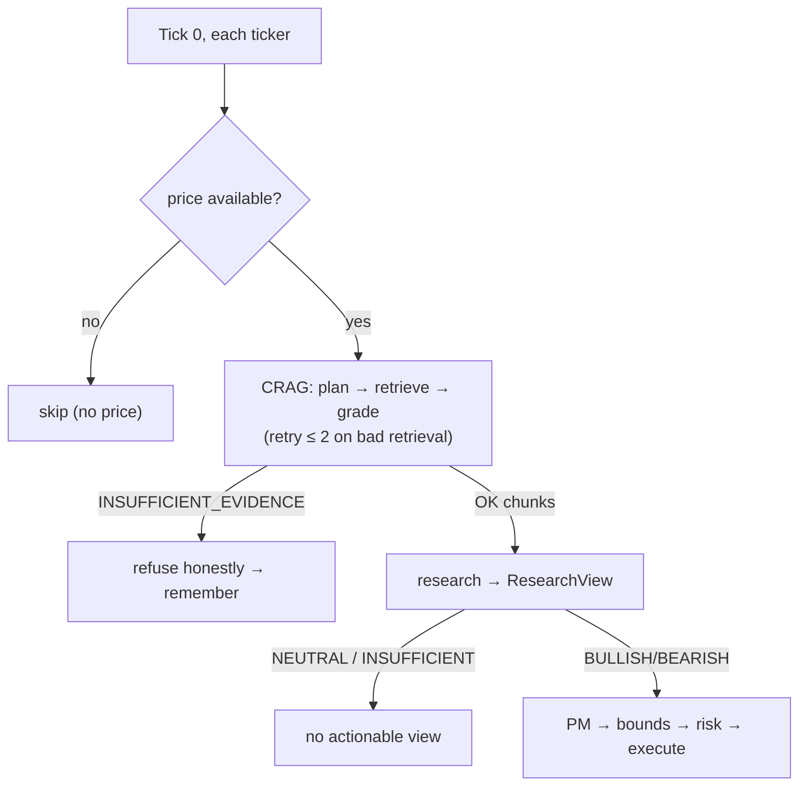
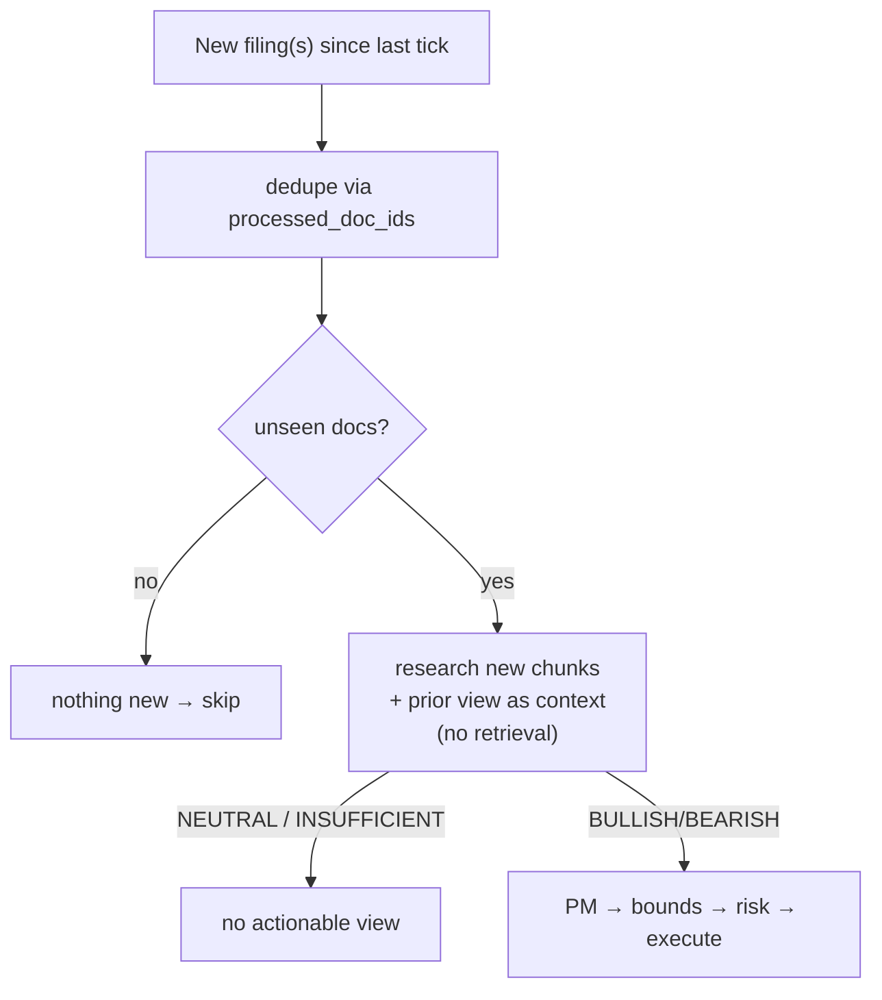
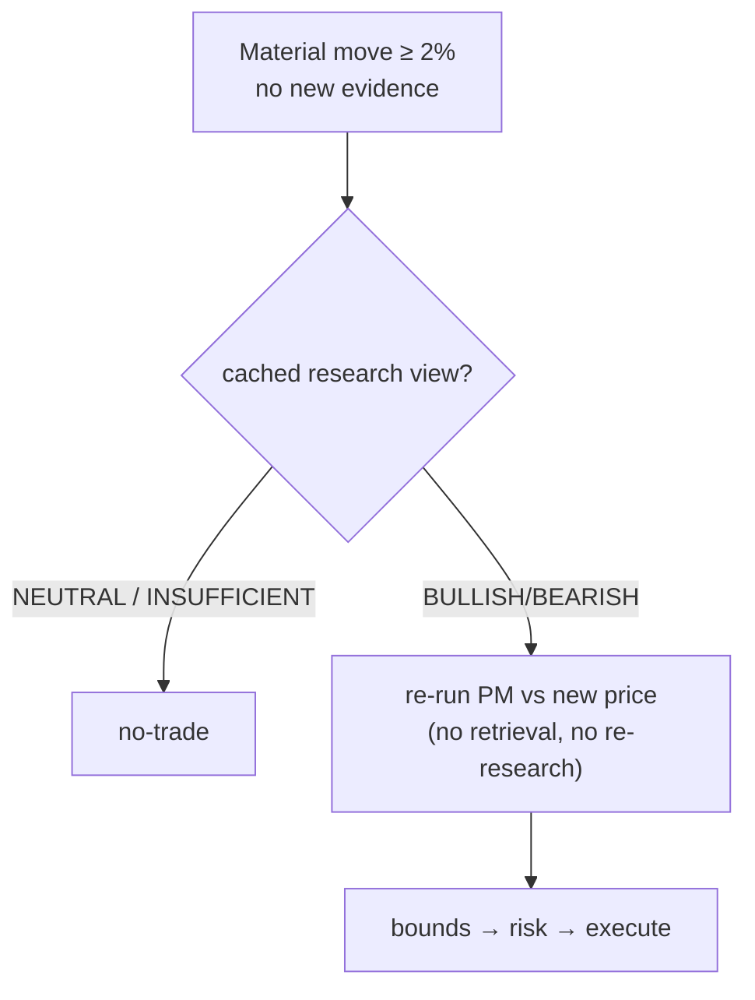
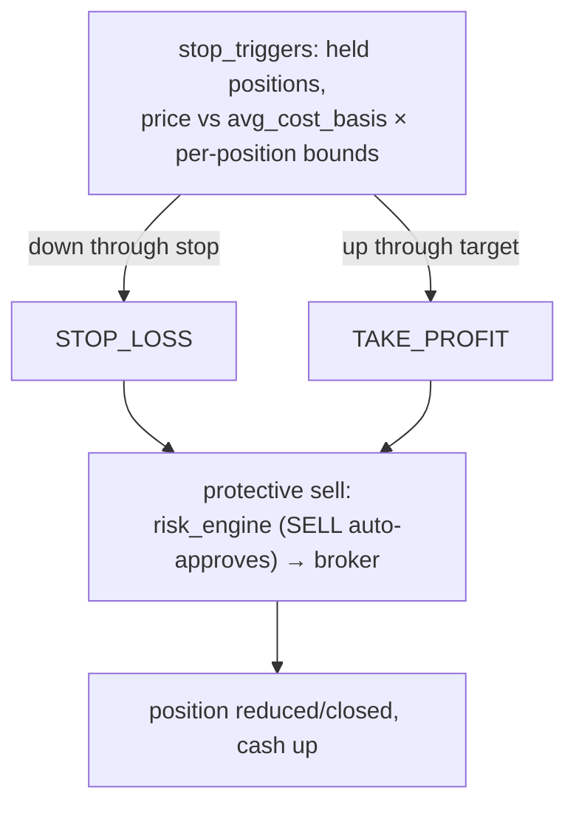
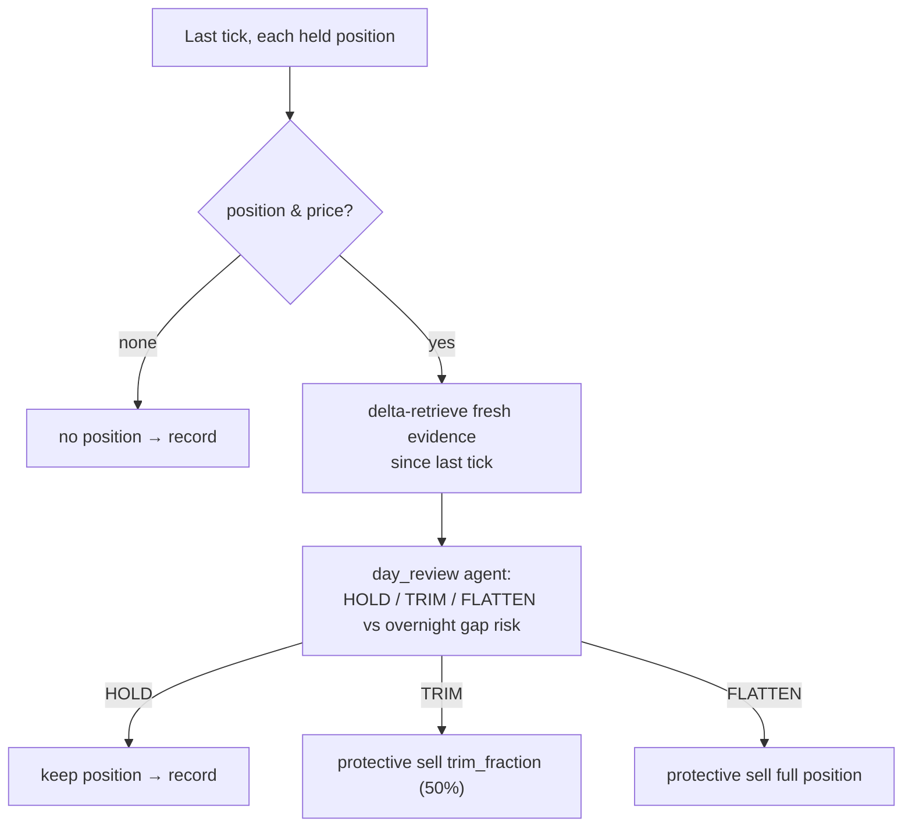

# Agentic Investment Firm

A multi-agent system that runs an AI paper-trading firm over a **replayed US trading day**.
A deterministic clock steps the day open→close; at each tick a dispatcher routes to exactly
one pipeline. Reasoning agents (Query-Gen, Relevance-Critic, Research, PM, Risk, Day-Review,
Reporting) make the **judgment** calls; deterministic code owns all **math and enforcement**
— sizing, risk limits, execution. Every buy passes a **human Risk Committee**, every claim
carries a **verified citation** from a **time-boxed RAG corpus**, and every action leaves a
**full, offline-replayable trace**.

> Design priority: **agentic system → guardrails → observability.** Reliability and safety
> over features.

## Table of contents

- [How to run](#how-to-run)
- [How to use](#how-to-use)
- [Architecture](#architecture)
- [Agentic paths](#agentic-paths)
- [Design](#design)
- [Guardrails](#guardrails)
- [Observability](#observability)
- [Repository layout](#repository-layout)
- [Documentation](#documentation)
- [Status](#status)

## How to run

**Prerequisites:** Docker (for the one-command path), or Python 3.11+ and Node 20+ (local dev).

The firm runs live against real providers — **Anthropic** for the agents and **Voyage +
Chroma** for RAG. Set those two keys first.

### 1. Configure keys

```bash
cp server/.env.example server/.env
```

Then edit `server/.env`:

```ini
LLM_MODE=live
ANTHROPIC_API_KEY=sk-ant-...
VOYAGE_API_KEY=pa-...
```

Missing keys in live mode fail loudly — no silent fallback.

### 2. Run the app (Docker — one command)

With `server/.env` in place (step 1), this builds the web UI + backend and runs live:

```bash
docker compose up --build    # then visit http://localhost:8000
```

Compose reads your keys from `server/.env`; SQLite persists in the `firm-data` volume across
restarts. (No `.env`? It still boots — in offline cassette mode.)

### 2b. Run the app (local dev)

In a virtual environment, `.[all]` installs everything (live providers + test deps) in one shot:

```bash
cd server
python -m venv .venv
source .venv/bin/activate        # Windows: .venv\Scripts\activate
pip install -e ".[all]"          # everything: Anthropic, Voyage, Chroma, test deps
uvicorn app.main:app --reload --port 8000
```

```bash
cd web && npm install && npm run build       # served by FastAPI at /  (or: npm run dev for HMR)
```

Full operational detail — including SSL/cert notes — is in the [runbook](docs/runbook.md).

### Offline mode (tests, eval, CI — no keys)

For the deterministic test suite and eval, the LLM router runs in `cassette` mode
(`LLM_MODE=cassette`, the `.env.example` default): it replays recorded responses keyed by
prompt hash, with an in-memory store + fake embedder for RAG. No network, no keys, no token
cost — this is what CI and the committed sample run use.

```bash
cd server
python -m venv .venv && source .venv/bin/activate   # Windows: .venv\Scripts\activate
pip install -e ".[dev]"     # walled network? append --trusted-host pypi.org --trusted-host files.pythonhosted.org
python -m pytest -q          # full deterministic suite
python -m eval.harness       # golden + red-team eval → docs/eval-report.md
```

Then inspect the committed sample run in [`docs/sample-run/`](docs/sample-run/): the
end-of-day report (`.json` + `.xlsx`) and the complete span trace (`trace.jsonl`).

## How to use

Driving a trading day in the dashboard:

1. **Datasets & Run** — **recommended:** hit **Load demo dataset** to seed a scripted NVDA
   day (2026-05-29) that fires every dispatch path in a single run — the fastest way to see
   the full system in action. To use your own data instead, enter a date (e.g. `2024-05-23`)
   and tickers (e.g. `NVDA`) and **Ingest** (prices from yfinance, corpus from SEC EDGAR,
   both need network; `SPY` is always added as the benchmark). Then **Run replay** on the
   ready day.
2. **Event Feed** — every span streams live as the day replays.
3. **Approvals** — the Risk Committee inbox. Every buy waits here; approve / edit qty /
   reject. Risk-reducing sells and protective stops execute automatically.
4. **Report** — end-of-day P&L vs SPY, holdings, decision log with citations;
   **Download .xlsx** for the second reporting channel.
5. **Observability** — cost rollup, belief-evolution per ticker, **Export trace (JSONL)**,
   and **Reset store** (confirm-gated).

### API quick reference

| Action | Endpoint |
| --- | --- |
| Ingest a day | `POST /datasets {date, tickers}` |
| List ready days | `GET /datasets` |
| Run replay | `POST /run/replay {date, tickers}` |
| Live event stream | `WS /stream` · `GET /runs/{id}/feed` |
| Approvals inbox | `GET /approvals?status=PENDING` |
| Decide | `POST /approvals/{id}/decide {decision, approver, edited_quantity}` |
| Report | `GET /runs/{id}/report` · `GET /runs/{id}/report.xlsx` |
| Belief timeline | `GET /runs/{id}/tickers/{sym}/memory` |
| Cost rollup | `GET /runs/{id}/cost` |
| Export trace | `GET /runs/{id}/export` |
| Reset store | `POST /admin/reset {confirm: true}` |

## Architecture

The firm replays one historical US trading day. The core split is deliberate:

- **LLM agents make judgments** — what evidence is relevant, what the thesis is,
  buy/sell/hold, and exit bounds.
- **Deterministic code makes decisions that touch money or truth** — retrieval routing,
  position sizing, bound clamping, stop/target enforcement, and execution.

Orchestration is **explicit deterministic code** (`firm/runner.py` + `firm/dispatcher.py`)
with state in SQLite — not a graph framework. The day is sliced into ticks; on each tick the
dispatcher picks exactly **one** path per ticker (first-match-wins). LLM agents run only at
the leaves; money-touching steps are deterministic; every step emits a span.

### Component map



### The daily loop + dispatcher

`runner._run_ticks` walks each tick, gathers three signals (price move, new docs,
stop/target triggers), and asks the dispatcher for the path. **First match wins; one path
per tick.** At the last tick it is always `DAY_REVIEW` even if a filing also landed; a
stop/target only fires when nothing higher-priority did.



### Shared sub-flow: PM → bounds → risk → execution

`CONTEXT_BUILD`, `INCREMENTAL_NEWS`, and `PRICE_REEVAL` all converge here. This is where the
per-position exit bounds are born and where the human gate lives.



- **Sizing is deterministic** — the PM never chooses quantity.
- **Bounds are clamped regardless of what the PM emits** (`clamp_bounds`: floor
  `min_bound_pct`, caps `max_stop_loss_pct` / `max_take_profit_pct`). The LLM proposes; code
  enforces.
- `risk_engine` has no policy REJECT: impossible fills (insufficient cash, oversell) are
  refused **physically** by the broker, not by a rule.

### Exit-bounds lifecycle



Bounds are set **at the BUY fill** and persisted per position (fallback to config defaults
if a position carries none). Enforcement is the deterministic `MONITOR_SELL` path — **no LLM
on the hot path**. On new data the PM may revise bounds, but only when it **trades again**;
a plain HOLD keeps the existing bounds.

More prose and per-case detail: [`docs/architecture.md`](docs/architecture.md).

## Agentic paths

Each tick gathers three signals (price move, new docs, stop/target triggers) and the
dispatcher routes to one path. Priority is top-to-bottom; the last tick is always
`DAY_REVIEW`, a stop/target only fires when nothing higher-priority did.

| Path | Trigger | Research? | LLM? | What happens |
| --- | --- | --- | --- | --- |
| `CONTEXT_BUILD` | tick 0 (market open) | full corrective RAG | yes | build open thesis → maybe trade |
| `INCREMENTAL_NEWS` | new filing since last tick | new docs only (skips retrieval) | yes | revise thesis vs prior view → maybe trade |
| `PRICE_REEVAL` | abs move ≥ threshold (2%) | reuse cached view | PM only | re-decide against the new price |
| `MONITOR_SELL` | price crosses a position's stop/target | none | **no** | deterministic protective sell (up *or* down) |
| `DAY_REVIEW` | last tick (pre-close) | delta evidence | yes | HOLD / TRIM / FLATTEN vs overnight gap risk |
| `SKIP` | no signal | none | no | no-op |

`CONTEXT_BUILD` and `DAY_REVIEW` fan out to all tickers; `INCREMENTAL_NEWS`, `PRICE_REEVAL`,
and `MONITOR_SELL` only touch the affected ticker. Exit bounds are set at the buy fill,
clamped to firm caps, persisted per position, and enforced deterministically thereafter —
no LLM on the protective-sell hot path.

Each path below ends either in the shared **PM → bounds → risk → execute** sub-flow (see
[Architecture](#architecture)) or in a deterministic protective sell.

### `CONTEXT_BUILD` — start of day (tick 0)

Full corrective-RAG research to build the opening thesis per ticker.



### `INCREMENTAL_NEWS` — new filing mid-day

A filing landed since the last tick. **Skips CRAG retrieval** — pushes the new chunks
straight to research with the prior view as context. Already-seen docs are deduped via
`processed_doc_ids` on the ticker memory.



### `PRICE_REEVAL` — material move, no new evidence

Move ≥ `price_move_threshold` (default 2%). **No retrieval, no re-research** — reuse the
cached research view and re-run the PM against the new price.



### `MONITOR_SELL` — stop/target hit (price up *or* down)

Fully deterministic, **no LLM, no human gate**. Both downside (stop loss) and upside (take
profit) exits go through the same protective-sell path.



### `DAY_REVIEW` — end of day (last tick)

The **overnight-gap** check, distinct from intraday bounds: a position can sit inside its
stop/target band yet still be flattened pre-close for gap risk. The only path that can do a
**partial** (TRIM) exit.



### `SKIP` — no signal

No new filing, no material move, no stop/target hit, not the open or close. The tick is a
no-op: nothing is researched, no LLM runs, the book is untouched.

Per-case prose walkthroughs: [`docs/architecture.md`](docs/architecture.md).

## Design

Key decisions, with full rationale in the ADRs:

- **Deterministic orchestration, not LangGraph.** Explicit code + DB state instead of a
  graph with `interrupt()` — chosen for debuggability, crash recovery, and honest control
  flow. See [`docs/why-not-langgraph.md`](docs/why-not-langgraph.md) (supersedes ADR-001).
- **LLM proposes, code enforces.** The PM never picks quantity; sizing is deterministic and
  cash-capped. Exit bounds are clamped regardless of what the model emits. The risk engine
  has no policy REJECT — impossible fills are refused physically by the broker.
- **Time-boxed truth.** A hard lookahead boundary blocks any document or price dated after
  `as_of`; corrective RAG refuses honestly rather than fabricating a thesis.
- **SQLite for state + trace** — one durable, offline-replayable store. See the ADRs for the
  full set of choices (state store, RAG/embeddings, LLM routing, risk engine, observability,
  eval cassettes).

## Guardrails

Defense in depth — every path is subject to all of them:

- **Lookahead assertion** — no future-dated data enters context.
- **Injection quarantine** — retrieved chunks are scanned; prompt-injection content is
  quarantined before it reaches an agent.
- **Corrective-RAG refusal** — bad retrieval retries ≤ 2, then honest
  `INSUFFICIENT_EVIDENCE`.
- **Citation verification** — uncited claims and unsupported numbers are stripped.
- **Deterministic risk engine + HITL** — buys ≥ notional threshold pause for the human Risk
  Committee; sells auto-approve.
- **Resource circuit-breaker** — per-run caps on LLM calls / tokens / wall-clock; a breach
  halts the run (human-wait time is credited back).
- **Partial-failure isolation** — one ticker's pipeline error degrades to an error span; the
  run continues.
- **Crash recovery** — on boot, `APPROVED`-but-unfilled trades are re-driven idempotently
  (never a double-fill) and the ledger invariant is re-verified.

## Observability

Every step — `TICK`, `AGENT`, `LLM`, `GUARDRAIL`, `EXECUTION`, `HITL` — is a span in SQLite,
streamed live over SSE and exportable as JSONL. Any decision can be replayed end-to-end,
offline, from committed artifacts. The end-of-day report ships through two channels
(dashboard + Excel) with a no-LLM deterministic fallback so it always works offline.

## Repository layout

```
server/   FastAPI backend + the agent system (orchestrator, RAG, risk engine, paper broker, trace store, eval harness)
web/      React dashboard (feed, approvals, portfolio, report, observability, datasets)
docs/     PRD, architecture, ADRs, runbook, eval report, sample run
```

## Documentation

- [`docs/runbook.md`](docs/runbook.md) — operate it: run, drive a day, approve, report, recover
- [`docs/architecture.md`](docs/architecture.md) — system architecture (components, dispatch, pipelines, guardrails, diagrams)
- [`docs/why-not-langgraph.md`](docs/why-not-langgraph.md) — the orchestration decision (supersedes ADR-001)
- [`docs/eval-report.md`](docs/eval-report.md) — golden + red-team eval results
- [`docs/prd.md`](docs/prd.md) — product requirements
- [`docs/adrs/`](docs/adrs/) — architecture decision records

## Status

Runnable. The core agentic pipeline, all six dispatch paths, the full guardrail stack,
observability views, two-channel reporting (dashboard + Excel), a deterministic eval harness
with CI, and crash recovery are implemented and tested (offline). On-demand ticker ingestion
is the one stretch item, kept minimal.
