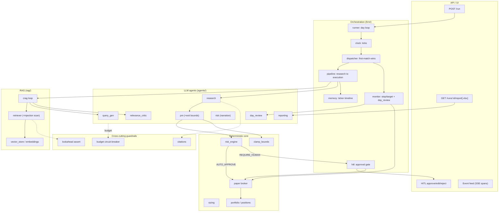
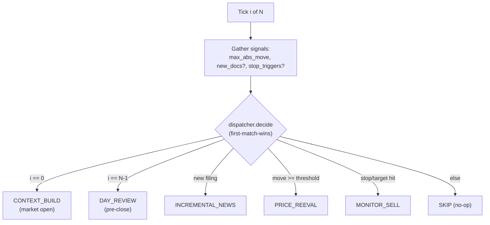
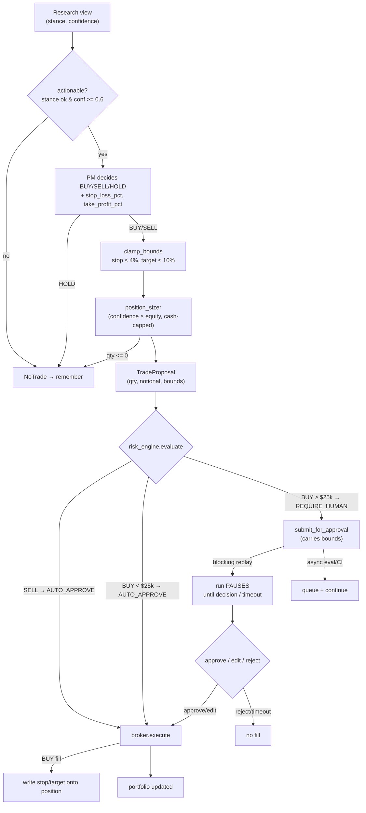
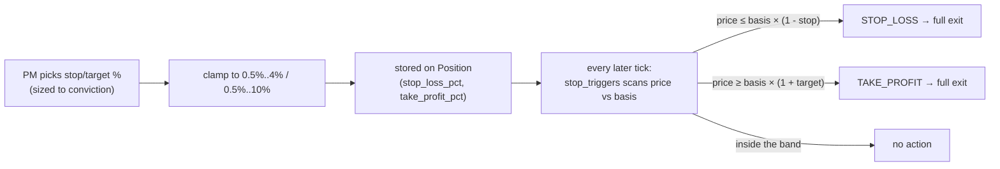
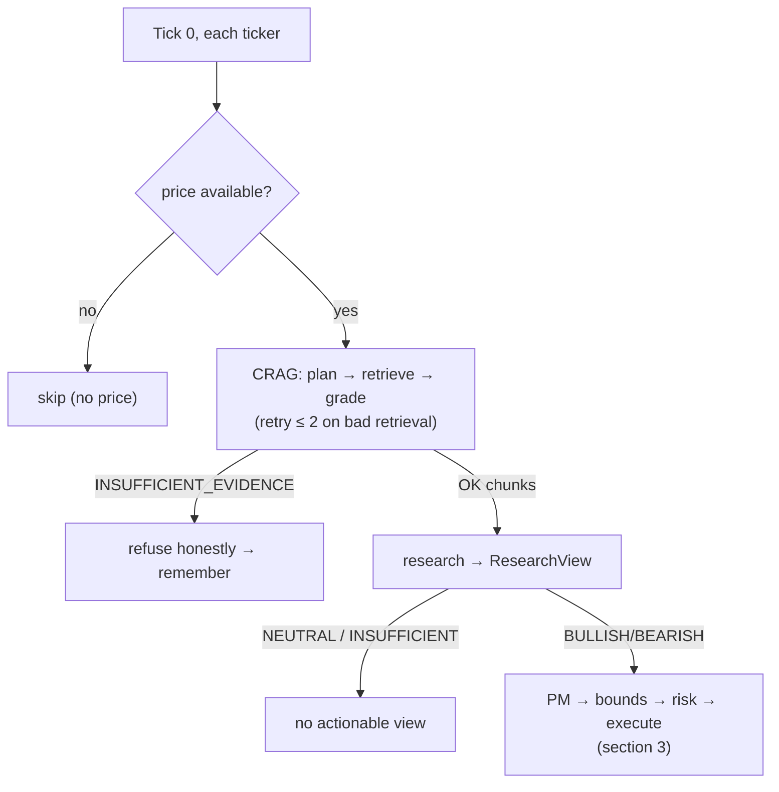
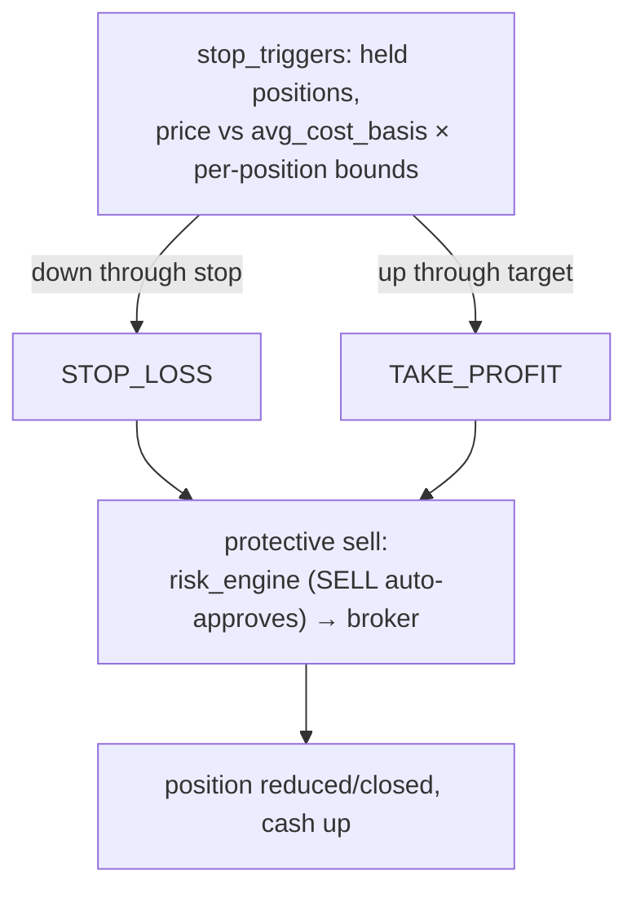
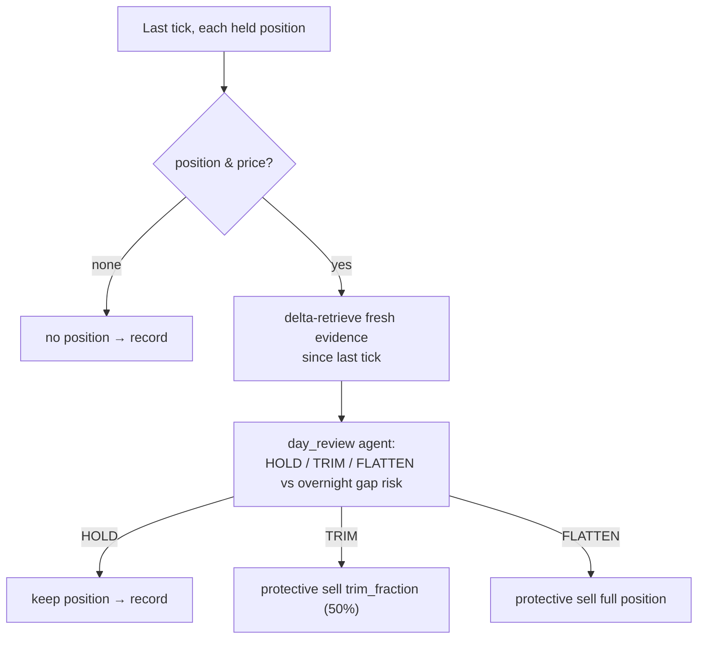

# Architecture

Agentic investment firm that replays one trading day, tick by tick, over a fixed
news + price corpus. LLM agents make **judgments** (what's relevant, what the thesis
is, buy/sell/hold, exit bounds); deterministic code makes **math and enforcement**
decisions (retrieval routing, sizing, bound clamping, exit triggers, execution).

The day is sliced into ticks (hourly by default, `tick_interval_minutes`). On each tick
a **deterministic dispatcher** picks exactly one path per ticker. Only the open and the
incremental-news paths run fresh research; everything else is cheaper by design.

---

## 1. Component layers



---

## 2. The daily loop + dispatcher (every tick)

`runner._run_ticks` walks each tick, gathers three signals (price move, new docs,
stop/target triggers), and asks the dispatcher for the path. **First match wins; one
path per tick.**



Priority matters: at the **last** tick it is always `DAY_REVIEW` even if a filing also
landed; a stop/target only fires when nothing higher-priority did. `CONTEXT_BUILD` and
`DAY_REVIEW` fan out to **all** tickers; `INCREMENTAL_NEWS`/`PRICE_REEVAL`/`MONITOR_SELL`
only touch the affected tickers.

| Path | Trigger | Research? | LLM? | Outcome |
|---|---|---|---|---|
| `CONTEXT_BUILD` | tick 0 | full CRAG | yes | open thesis → maybe trade |
| `INCREMENTAL_NEWS` | new filing | new docs only | yes | revise thesis → maybe trade |
| `PRICE_REEVAL` | move ≥ 2% | reuse cached view | PM only | re-decide vs new price |
| `MONITOR_SELL` | price crosses stop/target | none | **no** | deterministic protective sell |
| `DAY_REVIEW` | last tick | delta evidence | day_review | HOLD / TRIM / FLATTEN |
| `SKIP` | no signal | none | no | nothing |

---

## 3. Shared sub-flow: PM → bounds → risk → execution

`CONTEXT_BUILD`, `INCREMENTAL_NEWS`, and `PRICE_REEVAL` all converge on
`_pm_risk_route → _risk_and_route`. This is where the **per-position exit bounds** are
born and where the human gate lives.



Notes:
- **Sizing is deterministic** — the PM never chooses quantity.
- **Bounds are clamped regardless of what the PM emits** (`clamp_bounds`: floor
  `min_bound_pct`, caps `max_stop_loss_pct` / `max_take_profit_pct`). The LLM proposes;
  code enforces.
- `risk_engine` has no policy REJECT: impossible fills (insufficient cash, oversell) are
  refused **physically** by the broker, not by a rule.
- The human-approval path persists bounds on the `ApprovalRequest` so the eventual fill
  still stamps them onto the position.

---

## 4. Exit-bounds lifecycle (the new mechanism)



- Bounds are set **at the BUY fill** and persisted per position; fallback to config
  defaults if a position somehow carries none.
- Enforcement is the deterministic `MONITOR_SELL` path — **no LLM** on the hot path.
- On new data the PM may revise bounds, but they are only rewritten **when it trades
  again**; a plain HOLD keeps the existing bounds.

---

## 5. Every case, end to end

### 5a. Start of day — `CONTEXT_BUILD`


### 5b. Middle — new data — `INCREMENTAL_NEWS`
New filing(s) since last tick. **Skips CRAG retrieval** — pushes the new chunks straight
to research with the prior view for context, then the section-3 sub-flow. Already-seen
docs are deduped via `processed_doc_ids` on the ticker memory.

### 5c. Middle — price moved — `PRICE_REEVAL`
Material move (≥ `price_move_threshold`, default 2%) with no new evidence.
**No retrieval, no re-research** — reuse the cached research view, re-run PM against the
new price (section 3). If the cached view is NEUTRAL/INSUFFICIENT, it no-trades.

### 5d. Middle — stop/target hit — `MONITOR_SELL`  (price up *or* down)

Fully deterministic. Both the downside (stop loss) and upside (take profit) exits go
through the same protective-sell path — no human gate, no LLM.

### 5e. Middle — hold / nothing
- PM returns **HOLD**, or sizing rounds to zero, or stance not actionable → `NoTrade`,
  recorded to memory, position (and its bounds) unchanged.
- No signal at all → dispatcher returns **SKIP**, the tick is a no-op.

### 5f. End of day — `DAY_REVIEW`

`day_review` is the **overnight-gap** check and is distinct from intraday bounds: a
position can sit inside its stop/target band yet still be flattened pre-close for gap
risk. It is the only path that can do a **partial** (TRIM) exit.

---

## 6. Cross-cutting guardrails (apply on every path)

| Guardrail | Where | Effect |
|---|---|---|
| **CRAG corrective refusal** | `rag/crag.py` | Bad retrieval retries ≤ 2, then honest `INSUFFICIENT_EVIDENCE` — never fabricates a thesis. |
| **Injection quarantine** | `rag/retriever.py` → `guardrails/injection.py` | Scans retrieved chunks; prompt-injection content is quarantined out before it reaches an agent. |
| **Lookahead assertion** | `guardrails/lookahead.py` | Hard boundary: no document/price dated after `as_of` can enter context. |
| **Budget circuit-breaker** | `guardrails/budget.py` | Per-run caps on LLM calls / tokens / wall-clock; breach raises `BudgetExceeded` and **halts the whole run** (not isolated). Human-wait time is credited back. |
| **Exit-bound clamp** | `agents/pm.py` | LLM-proposed stop/target forced inside firm caps. |
| **Risk gate (HITL)** | `guardrails/risk_engine.py` + `firm/hitl.py` | BUYs ≥ notional threshold pause for the Risk Committee; SELLs auto-approve. |
| **Citations** | `guardrails/citations.py` | Research claims must carry evidence references. |
| **Partial-failure isolation** | `firm/runner.py` | One ticker's pipeline error degrades to an error span; the run continues. Budget/approval-timeout are the exceptions that halt. |
| **Deterministic execution** | `state/broker.py` | Slippage + commission, market-hours + no-oversell + idempotency, single-transaction fills. |

---

## 7. Outputs

- **Live event feed** — every span (`TICK`, `AGENT`, `LLM`, `GUARDRAIL`, `EXECUTION`,
  `HITL`) streams over SSE.
- **End-of-day report** (`/runs/:id/report[.xlsx]`) — deterministic metrics (equity,
  return vs benchmark, trades, process stats) narrated by the `reporting` agent, with a
  no-LLM deterministic fallback so the channel always works offline.
```
